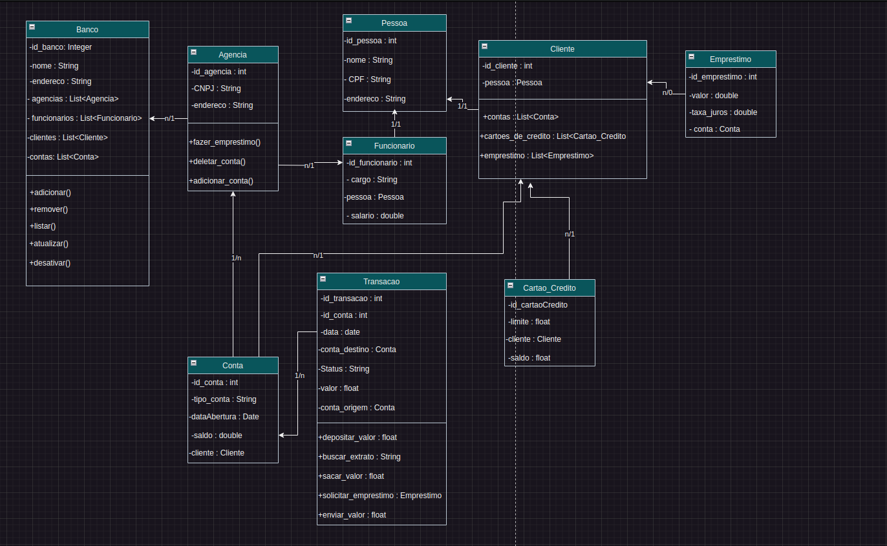

# Banco Raízes

Banco Raízes é um projeto comunitário desenvolvido como parte de um trabalho do programa {reprograma}, com o objetivo de promover a criação de projetos voltados para a comunidade. Este projeto visa oferecer suporte financeiro e educacional para jovens, incentivando o desenvolvimento econômico e social de comunidades locais.

## Visão Geral

Banco Raízes é uma plataforma bancária comunitária que fornece serviços financeiros básicos, como contas correntes, empréstimos e cartões de crédito, além de suporte para projetos comunitários. A plataforma foi criada para atender as necessidades de jovens e promover iniciativas que beneficiem a comunidade.

## Funcionalidades

- **Abertura de Contas:** Permite a abertura de contas correntes para indivíduos.
- **Gestão de Contas:** Facilita a visualização e gestão de saldo e transações.
- **Empréstimos:** Oferece empréstimos a juros baixos para projetos comunitários.
- **Cartões de Crédito:** Fornece cartões de crédito com limites ajustáveis.
- **Suporte a Projetos Comunitários:** Incentiva e apoia financeiramente iniciativas que beneficiem a comunidade.

